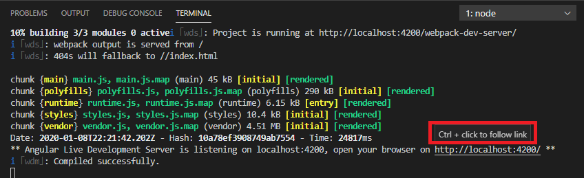

# Challenge Project for Stone Pagamentos
### Web Application made in Angular

## About
- Dollar quotation display in BRL;
- Insertion of 2 values: 
    - Amount in dollar: **Insert only numbers ~ EX: 35000**
    - US state rate: **Insert numbers and dot ~ EX: 4.56**
        - Returns 2 amounts in currency format: USD and BRL;
- IOF selection option with two values: Cash and Card;
    - Returns the sum of the selected IOF and the previous results of dollars and reais;

### Prerequisites
Node.js - [click for download](https://nodejs.org/en/)

Yarn - [click for download](https://yarnpkg.com/en/docs/install#windows-stable)

## Getting Started
Clone my repo in your computer

```git clone https://github.com/bjgrassi/stone-app.git```

### Installing
I used VSCode on Windows for development and I'll explain based on it:

- Open VSCode
- Select folder app-stone 

From the local VSCode terminal type

```cd client```

After get into the folder, install dependencies

```yarn install```

Run server

```yarn start```

*A new tab will open automatically in your browser.. If don't,* 
*just press `ctrl` + click http://localhost:4200/ (or click here ¯\_(ツ)_/¯)*



## Built With
* [Angular CLI](https://angular.io/) - The web framework used > version 8.3.21.
* [Currency API](https://docs.awesomeapi.com.br/api-de-moedas) - The API used
* [Bootswatch](https://bootswatch.com/) - The theme used
* [Ngx-Mask](https://www.npmjs.com/package/ngx-mask) - Mask for numbers